# Leaf Analyzer
Leaf Analyzer is an open-source GUI tool for automated measurement of leaf traits—area, dimensions, perimeter, count, green index, and percent damage (e.g., herbivory/disease). The application is implemented in MATLAB and distributed as a standalone program (no MATLAB license required). Installers are available for Windows, Linux, and macOS.

A detailed description is available in our article in Plant Phenomics:
[Leaf Analyzer: A Fully Automated and Open-Source Tool for High-Throughput Leaf Trait Measurement](https://authors.elsevier.com/sd/article/S2643-6515(25)00151-7).

## Latest updates

**2026/05/05** -- :fire::fire: Leaf Analyzer online pattern generator is available, [click to customize your own pattern](https://techlauncher-leafanalyzer.github.io/Leaf-Analyzer-Pattern-Generation/).

**2026/02/13** -- :fire::fire: Leaf Analyzer v2.6.0: New Green Leaf Index (GLI) Trait Measurement + Per-Leaf Exports to Spreadsheet.

**2025/12/12** -- :fire::fire: Leaf Analyzer v2.5.0: First public release

- A new suite of improved model checkpoints (denoted as **HQ-SAM 2**, beta-version) are released.

  
   
  <em>Figure 1. Leaf Analyzer UI.</em>

## 1. Getting started
### 1.1. Downloading and installing Leaf Analyzer
Download the latest release from [Releases](https://github.com/squashking/Leaf-Analyzer/releases)  and install the software according to the instructions:

<table border="1" cellspacing="0" cellpadding="6">
  <tr><th>Operation System</th><th>Installation</th><th>Launching</th></tr>
  <tr><td>Windows</td><td>Double click: LeafAnalyzerInstaller2.5_Windows.exe</td><td>Open via Start Menu → Leaf Analyzer (or the desktop shortcut, if created).</td></tr>
  <tr><td>Linux</td><td>sudo ./ LeafAnalyzerInstaller2.5_Linux.install</td><td>➢ cd /usr/Leaf_Analyzer/application  
➢ ./run_Leaf_analyzer.sh /usr/local/MATLAB/MATLAB_Runtime/R2025a/</td></tr>
  <tr><td>Mac OS</td><td>First unzip LeafAnalyzerInstaller2.5_Mac.zip, and then 
Control-click the unzipped file
(LeafAnalyzerInstaller2.5_Mac.app) → Open</td>
<td>Open via Applications → APPN → Leaf Analyzer (or Spotlight).  
If your processor is ARM64 (common for devices manufactured after 2020), open a terminal, and run:  
arch -x86_64 open /Applications/APPN/LeafAnalyzer/application/LeafAnalyzer.app
</td>
</tr>
</table>

### 1.2. Test Leaf Analyzer with images
Leaf Analyzer requires images captured with the Leaf Analyzer calibration pattern. For quick testing, use the datasets in [Datasets](Datasets/). 

To try your own images, first capture them with the pattern (see next section). See [Capture images with the Leaf Analyzer pattern](#13-capture-images-with-the-leaf-analyzer-pattern) 

### 1.3. Capture images with the Leaf Analyzer pattern
The [Patterns](Patterns/) folder contains PDF pattern files (A4–A1). They were generated in Inkscape for high precision. You can also customize your own pattern with our [online pattern generator](https://techlauncher-leafanalyzer.github.io/Leaf-Analyzer-Pattern-Generation/) (Please make sure to print the generated PDF file at 100% scale for accuracy). At the top of each PDF (to the right of the logo), you’ll see labels like 120×120–15 mm, which follow the format *pattern width* × *pattern height* – *AprilTag side length*. Enter these values directly in Settings → Pattern (Fig. 2b).

<ul>
  <li>Print PDFs at 100% scale on a standard office printer.</li>
  <li>Check the pattern dimensions with a ruler after it's printed.</li>
  <li>In Leaf Analyzer, enter the exact pattern dimensions in Settings → Pattern.</li>
</ul>

> **Note:** 
1). Leaves must be placed within the Region of Interest (Fig2.a). Any objects beyond the cut-off line will be disregarded.
2). If you add text labels to the image, place them only in the reserved text region (Fig. 2a). The text must also be within 3 cm of the top border of the ROI. Currently, the text recognition model supports digits (0–9), letters (a–z, A–Z), and three special characters: dash(-), underscore(_), and dot(.). 

<table>
  <tr>
    <td align="center"></td>
    <td align="center"></td>
  </tr>
</table>

<em>Figure 2. (a) Pattern specifications. (b) Pattern tab on the Settings panel.</em>

### 1.4 If your images were taken **without** the Leaf Analyzer pattern

If your images don’t include the Leaf Analyzer calibration pattern but have a **white (or light) background** and an **independent scale reference** (e.g., a ruler), you can follow the steps:

   - Overlay the four [AprilTags](Patterns/) from the Leaf Analyzer pattern onto the image (maintaining correct geometry).
   - Run Leaf Analyzer to measure traits in **pixels**. (Settings → Output → Dimension unit → pixel.)
   - Convert to metric units using a known-length object in the image (by multiplying a constant factor in the output spreadsheet file).

> **Tip:** The scale factor of area-based traits is the square of the factor for length-based traits.

### 1.5. Video Tutorials
Leaf morphological trait measurement demo
 [youtube link](https://youtu.be/liucWnU8v48)

 Leaf damage assessment demo
 [youtube link](https://youtu.be/od3qdbkg00o)

## 2. Tweak default settings (if needed)

The default settings work in most cases. In the scenarios below, you may wish to adjust them.

### 2.1 Adjust the min leaf area threshold

Leaf Analyzer applies a minimum leaf area threshold to speed up processing and suppress background noise (e.g., dirt). By default, this threshold is 5% of the largest leaf area in the image. If some small leaves are not segmented because they are much smaller than the largest leaf (Fig. 3b), lower the threshold to include them (e.g., 1%; Fig. 3c).

Where: Settings → Advanced → Min leaf area.

<table>
  <tr>
    <td align="center">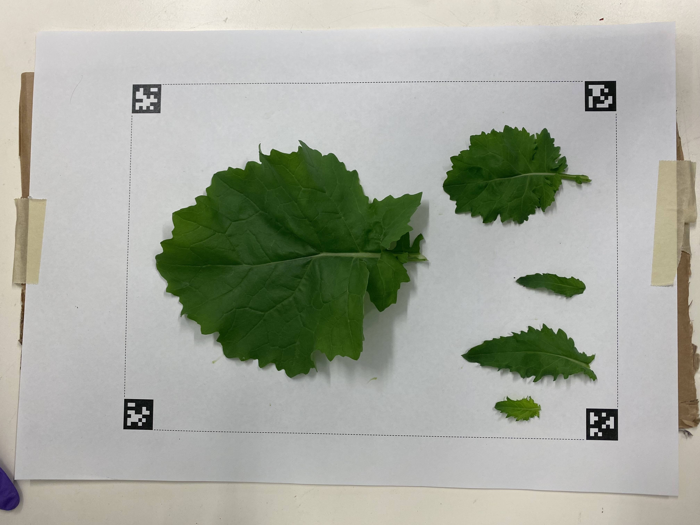</td>
    <td align="center">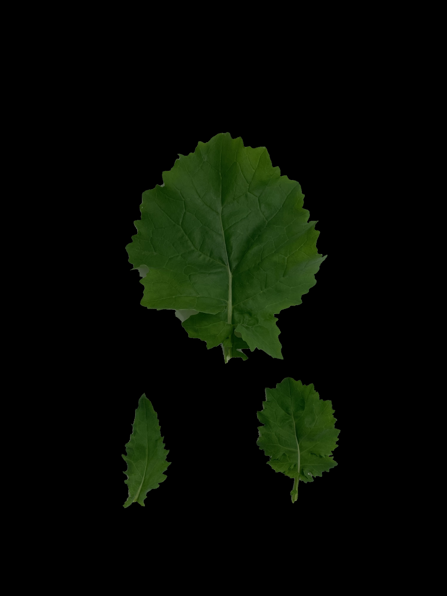</td>
    <td align="center">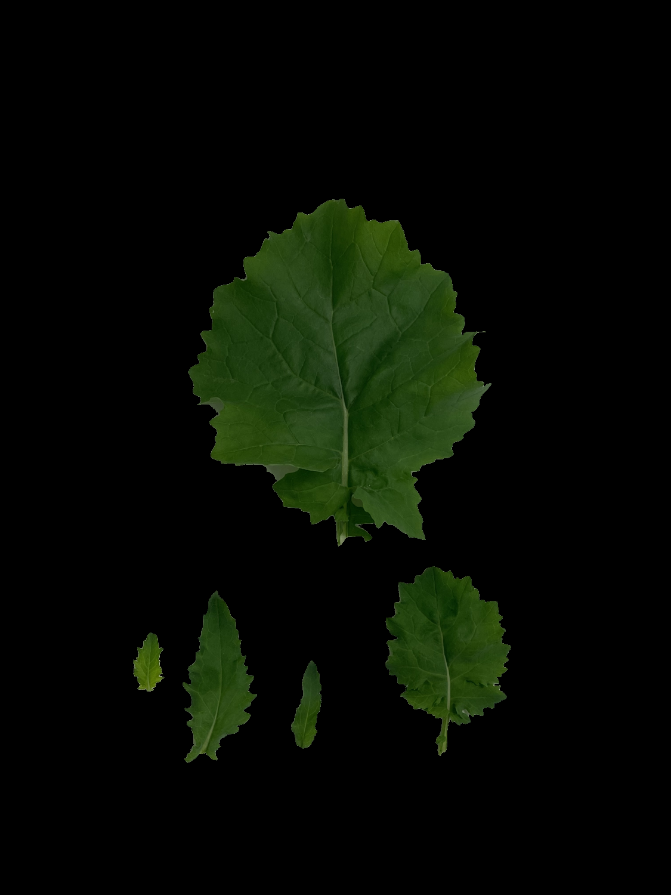</td>
    <td align="center">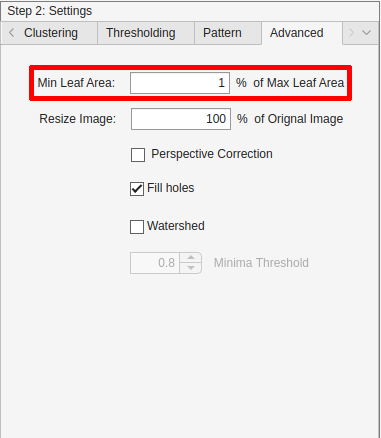</td>
  </tr>
</table>

<em>Figure 3. (a) Original RGB image with large size variation among leaves. (b) Two very small leaves are missed with the default Min leaf area threshold. (c) All leaves are segmented after lowering the threshold to 1%. (d) Location of the Min leaf area control in the Settings panel.</em>

### 2.2 Toggle Fill holes
By default, Leaf Analyzer performs hole filling during post-processing to improve object completeness. This could end up with undesired results (Fig. 4b). If so, disable the option to preserve internal holes (Fig. 4c).

Where: Settings → Advanced → Fill holes (check/uncheck).

<table>
  <tr>
    <td align="center">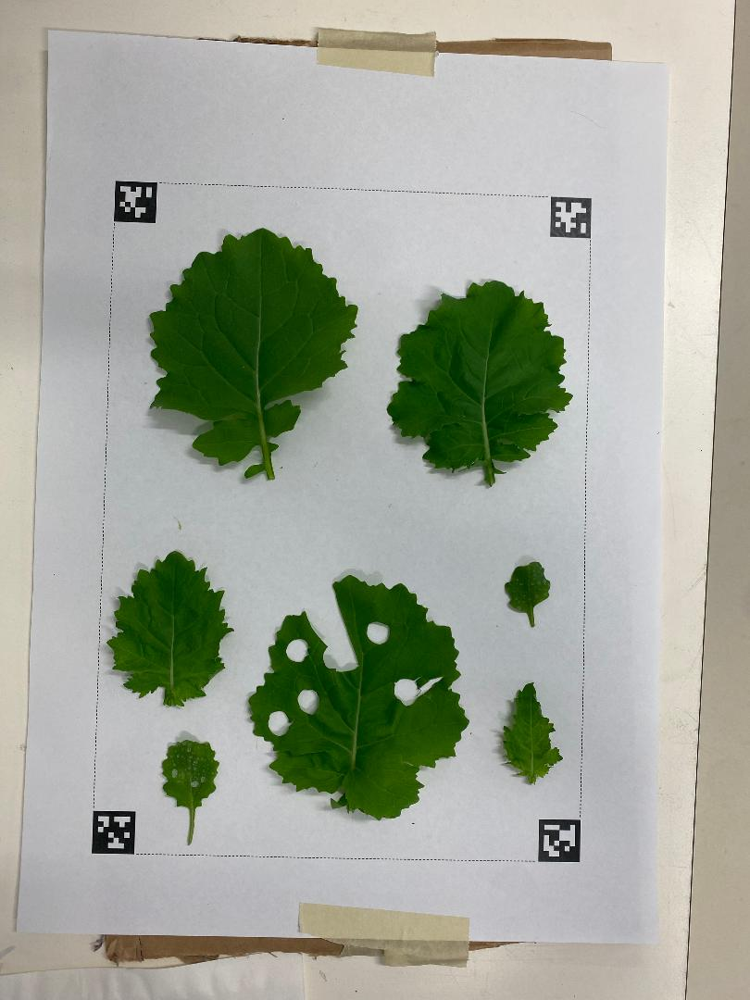</td>
    <td align="center">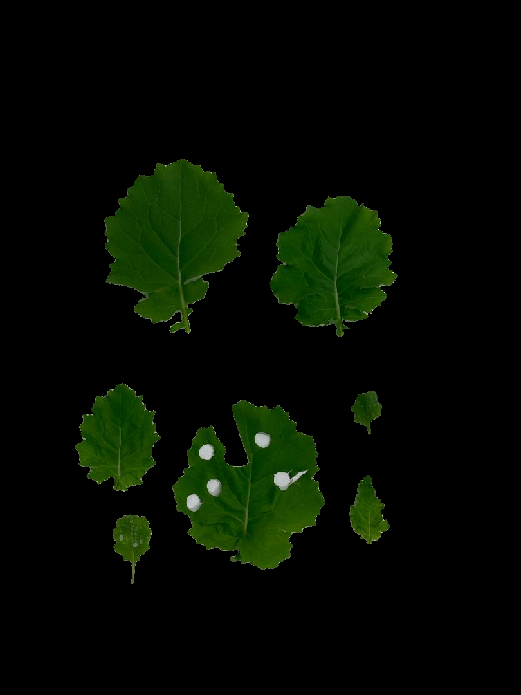</td>
    <td align="center">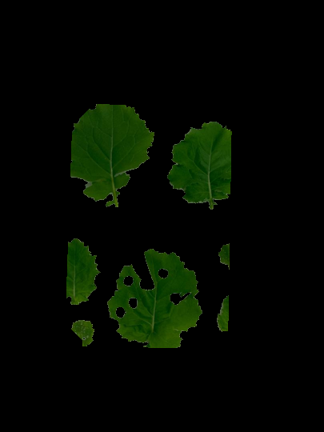</td>
    <td align="center">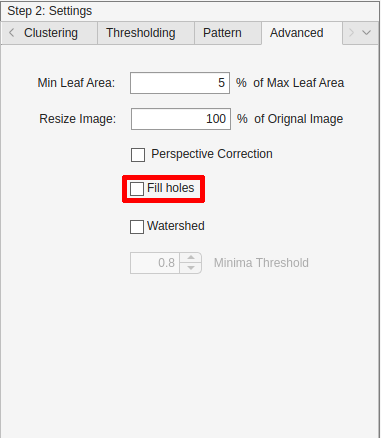</td>
  </tr>
</table>

<em>Figure 4. (a) Leaf with holes/punches. (b) With Fill holes enabled (default), holes are filled. (c) Unchecking Fill holes preserves them, yielding the desired segmentation. (d) Location of the Fill holes toggle in the Settings panel. </em>

### 2.3 Enable Perspective correction

Perspective correction is off by default. If images were captured at a skewed angle (not normal to the pattern plane), enabling this option can improve geometric accuracy (Fig. 5c).

Where: Settings → Advanced → Perspective correction.

<table>
  <tr>
    <td align="center">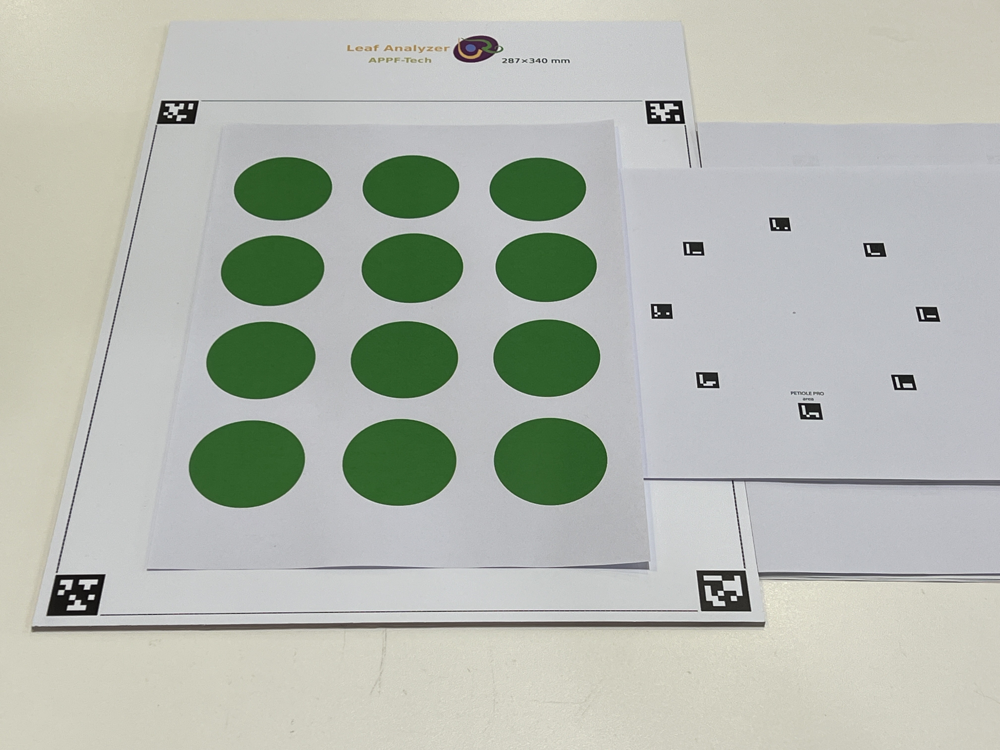</td>
    <td align="center">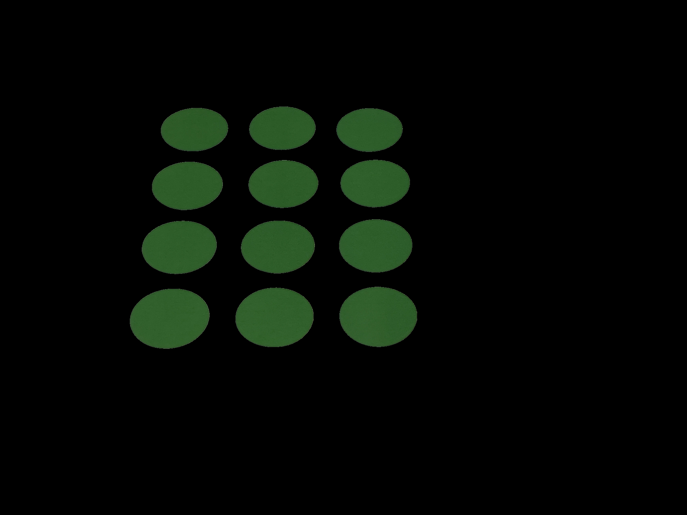</td>
    <td align="center">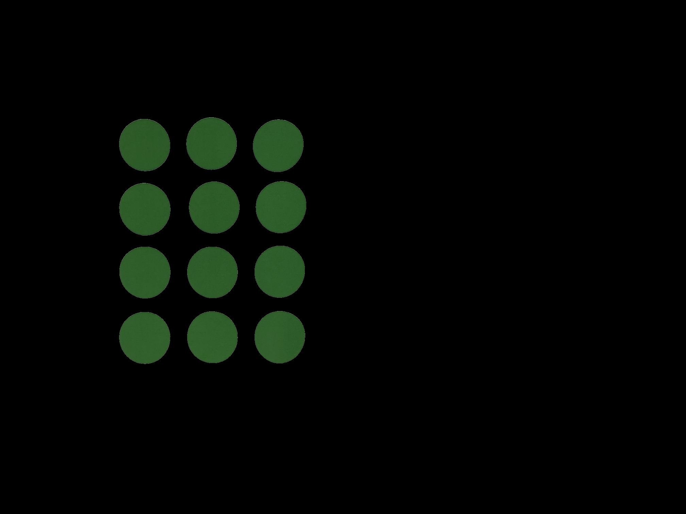</td>
    <td align="center">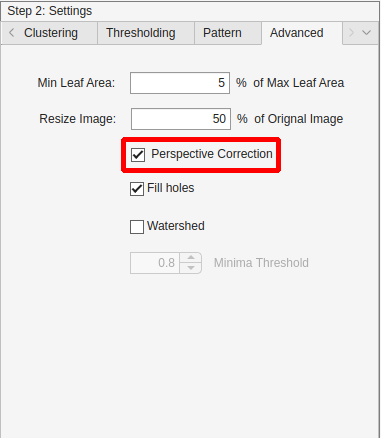</td>
  </tr>
</table>

<em>Figure 5. (a) Image captured at an oblique angle. (b) Segmentation using default settings (perspective correction off). (c) Segmentation with Perspective correction enabled. (d) Location of the Perspective correction control in the Settings panel. </em>
