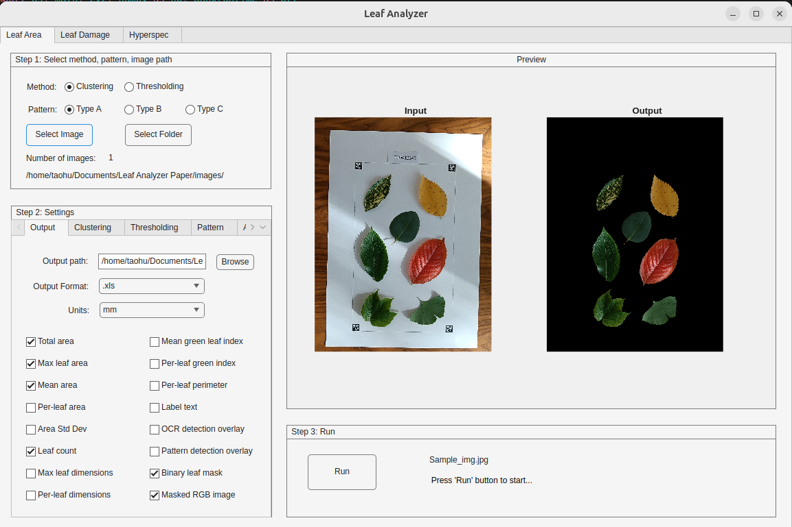
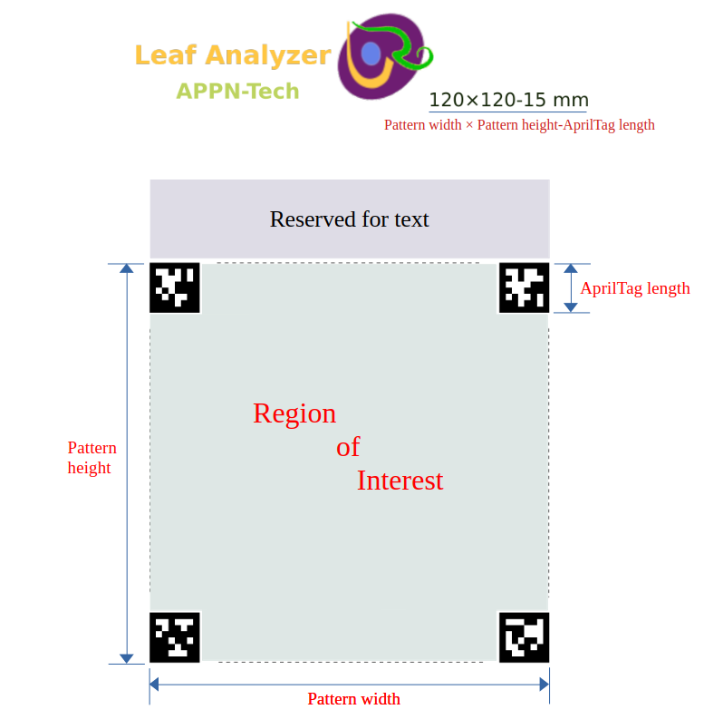
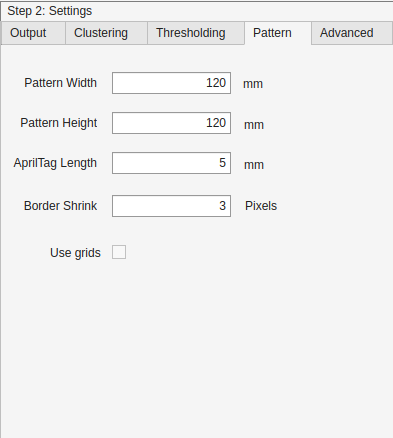

# Leaf_Analyzer
Leaf Analyzer is an open-source GUI tool for automated measurement of leaf traits—area, dimensions, perimeter, count, and percent damage (e.g., herbivory/disease). The application is implemented in MATLAB and distributed as a standalone program (no MATLAB license required). Installers are available for Windows, Linux, and macOS.

A detailed description is available in our article in Plant Phenomics:
[Leaf Analyzer: A Fully Automated and Open-Source Tool for High-Throughput Leaf Trait Measurement](https://authors.elsevier.com/sd/article/S2643-6515(25)00151-7).

  
   
  <em>Figure 1. Leaf Analyzer UI.</em>

## 1. Getting started
### 1.1. Downloading and installing Leaf Analyzer
Download the latest release from [Releases](https://github.com/squashking/Leaf-Analyzer/releases)  and install the software according to the instructions:

<table border="1" cellspacing="0" cellpadding="6">
  <tr><th>Operation System</th><th>Installation</th><th>Launching</th></tr>
  <tr><td>Windows</td><td>Double click: LeafAnalyzerInstaller2.5_Windows.exe</td><td>Open via Start Menu → Leaf Analyzer (or the desktop shortcut, if created).</td></tr>
  <tr><td>Linux</td><td>sudo ./ LeafAnalyzerInstaller2.5_Linux.install</td><td>➢ cd /usr/Leaf_Analyzer/application  
➢ ./run_Leaf_analyzer.sh /usr/local/MATLAB/MATLAB_Runtime/R2025a/</td></tr>
  <tr><td>Mac OS</td><td>First unzip LeafAnalyzerInstaller2.5_Mac.zip, and then 
Control-click the unzipped file
(LeafAnalyzerInstaller2.5_Mac.app) → Open</td><td>Open via Applications → Leaf Analyzer (or Spotlight).</td></tr>
</table>

### 1.2. Test Leaf Analyzer with images
Leaf Analyzer requires images captured with the Leaf Analyzer calibration pattern. For quick testing, use the datasets in [Datasets](Datasets/). 

To try your own images, first capture them with the pattern (see next section). See [Capturing images with the Leaf Analyzer pattern](#13-capture-images-with-the-leaf-analyzer-pattern) 

### 1.3. Capture images with the Leaf Analyzer pattern
The [Patterns](Patterns/) folder contains PDF pattern files (A4–A1) and a Word template for custom sizes. PDFs were generated in Inkscape for high precision.

<ul>
  <li>Print PDFs at 100% scale on a standard office printer.</li>
  <li>If you customize the pattern (Word template), ensure printed dimensions are accurate.</li>
  <li>In Leaf Analyzer, enter the exact pattern dimensions in Settings → Pattern.</li>
</ul>

> **Note:** Leaves must be put within the Region of Interest (Fig2.a). Any objects beyond the cut-off line will be disregarded.

<table>
  <tr>
    <td align="center"></td>
    <td align="center"></td>
  </tr>
</table>

<em>Figure 2. (a) Pattern specs. (b) Pattern tab on the Settings panel.</em>

### 1.4 If your images were taken **without** the Leaf Analyzer pattern

If your images don’t include the Leaf Analyzer calibration pattern but have a **white (or light) background** and an **independent scale reference** (e.g., a ruler), you can follow the steps:

1. **Superimpose AprilTags**
   - Overlay the four **AprilTags** from the Leaf Analyzer pattern onto the image (maintaining correct geometry).
   - Then run Leaf Analyzer to obtain measurements in metric units.

2. **Measure in pixels and convert**
   - Run Leaf Analyzer to measure traits in **pixels**.
   - Convert to metric units using a known-length object in the image (by multiplying a constant factor in the output spreadsheet file).

> **Tip:** The scale factor of area-based traits is the square of the factor for length-based traits.

### 1.5. Video Tutorials
Leaf morphological trait measurement demo
 [youtube link](https://youtu.be/liucWnU8v48)

 Leaf damage assessment demo
 [youtube link](https://youtu.be/od3qdbkg00o)

